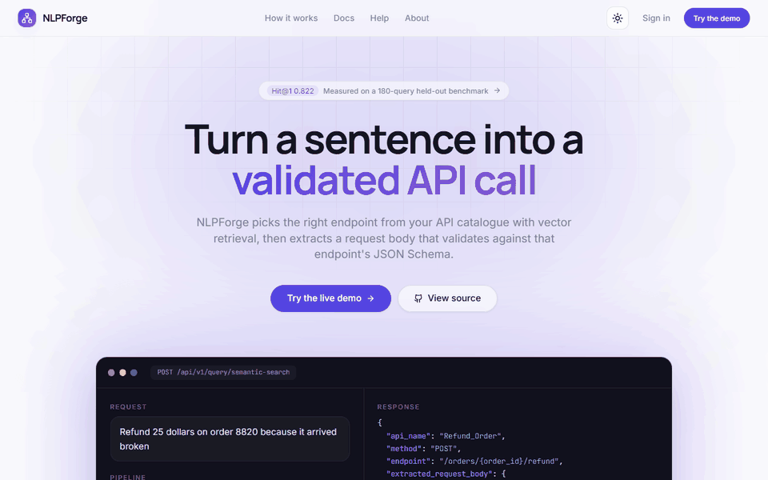
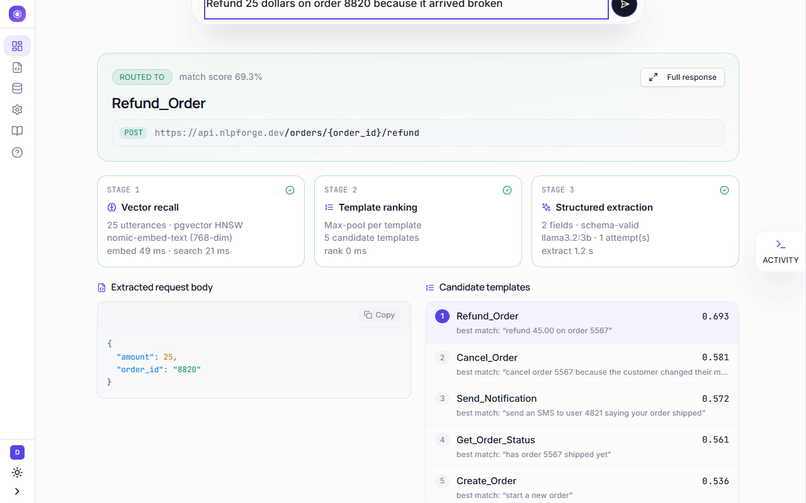
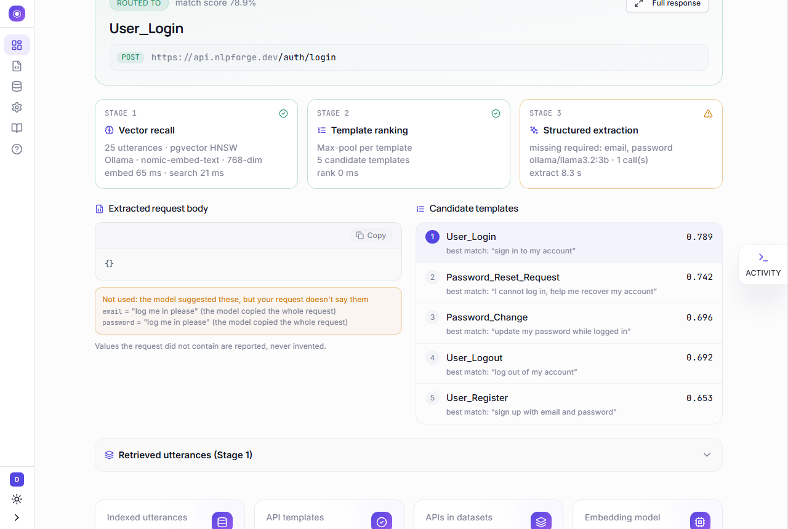
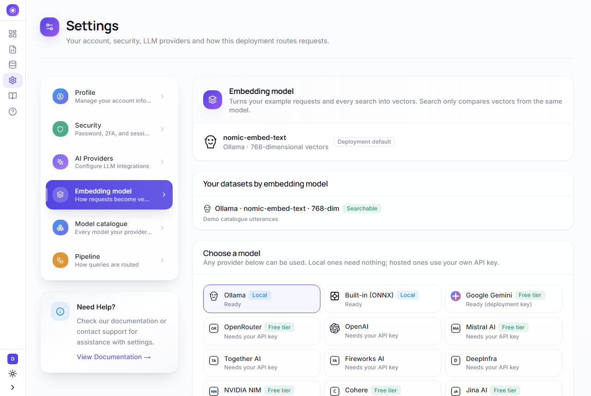
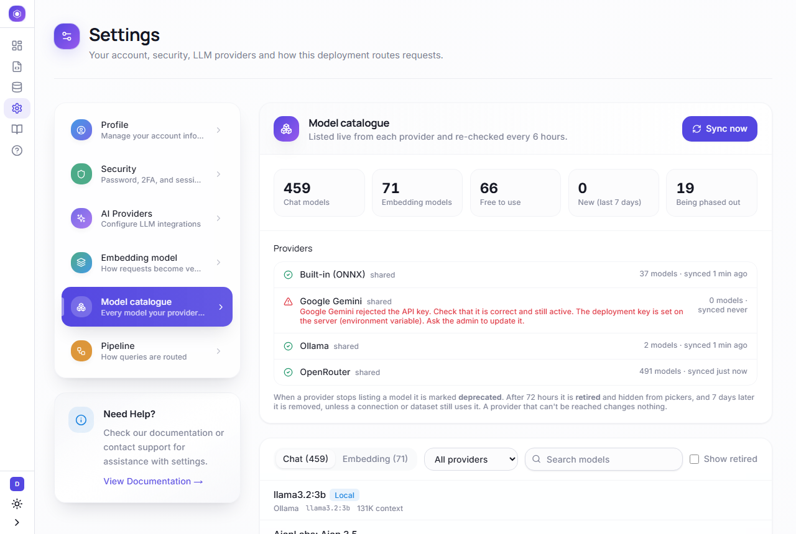

<div align="center">

# NLPForge

### Turn a plain-English request into a validated API call.

NLPForge picks the right endpoint from your API catalogue with vector search, then fills in a
request body that passes the endpoint's JSON Schema. Rules read what's stated outright; an LLM
fills only the rest, and any value it proposes has to appear in the request before it's used.
**Measured, grounded, and runnable with zero API keys.**


[Demo](#demo) · [Results](#measured-results) · [Quick start](#quick-start) · [Architecture](docs/ARCHITECTURE.md) · [Benchmarks](evals/README.md)

</div>

<a id="demo"></a>



<sub>The real app, recorded with [`scripts/record_demo.mjs`](scripts/record_demo.mjs): routing, grounded extraction, live model lists, and switching embedding models.</sub>

## At a glance

| | |
|---|---|
| **Routing** | **80%** right on the first pick, **97%** in the top 3: 180 held-out requests through the live API. CI blocks merges below 78%. |
| **Extraction** | **98%** of extracted values correct. Invented values per 100 requests: **55 → 1**. |
| **Speed** | ~100 ms to route. Simple requests are fully answered in **~250 ms with no LLM call**. |
| **Models** | Chat and embedding models from **20+ providers**, local or cloud. Model lists are fetched live, never hard-coded. |
| **Runs anywhere** | `docker compose up`: fully offline on Ollama, **no API key required**. |

**What this project demonstrates:** a measured retrieval pipeline (benchmarks in CI, not
vibes) · a hybrid rules + LLM extractor with a grounding check against hallucination · async
FastAPI with PostgreSQL + pgvector, row-level multi-tenancy, Celery and Redis · a provider-agnostic
model layer with automatic lifecycle management · a Next.js 16 / TypeScript product UI ·
229 tests.

## How it works

```text
"Refund 25 dollars on order 8820 because it arrived broken"
   │
   ├─ 1 · Recall    embed the request → top-25 similar example requests (pgvector HNSW, per tenant)
   ├─ 2 · Rank      max-pool scores per API → Refund_Order
   └─ 3 · Extract   rules read  order_id = "8820", amount = 25          (no model needed)
                    LLM only for what's left → every value checked against the request
   ▼
POST /orders/{order_id}/refund   { "order_id": "8820", "amount": 25 }   ok · 2 ms · rules only
```

It is deliberately **not an agent**: no planning loop, no multi-step execution. One request
resolves to one endpoint, and when a value is missing it says which one instead of inventing it.

<table>
<tr>
<td width="50%"></td>
<td width="50%"></td>
</tr>
<tr>
<td align="center"><sub>Every value says where it came from and how sure it is</sub></td>
<td align="center"><sub>Missing values are reported, never made up</sub></td>
</tr>
<tr>
<td width="50%"></td>
<td width="50%"></td>
</tr>
<tr>
<td align="center"><sub>Pick any embedding model; datasets are tagged with theirs</sub></td>
<td align="center"><sub>Models listed live; retired ones phased out automatically</sub></td>
</tr>
</table>

## Features

- **Semantic routing:** vector search over example requests, max-pooled per API template.
- **Grounded extraction:** schema-driven rules first (instant, exact). An LLM only for the
  remaining fields, and its values must appear in the request or they're flagged, not used.
  Per-field source and confidence.
- **Any model, any provider:** Ollama, built-in ONNX, Gemini, OpenAI, Anthropic, Groq, OpenRouter,
  Mistral, Cohere, NVIDIA, Together, Jina and more. Every provider is listed even without a
  deployment key; users bring their own.
- **Model lifecycle:** a scheduled job syncs each provider's live model list. New models appear;
  ones a provider drops are deprecated, retired, then removed once nothing uses them. An outage
  never retires anything.
- **Embedding safety:** every dataset records the provider, model and dimension that embedded it.
  Search never compares vectors from different models; it offers *switch model* or *re-embed*
  instead. Wide models (for example 3072-dim) get a half-precision index automatically.
- **Your own API catalogue:** each user documents their APIs as templates and switches them on
  (only the owner can). An LLM generates example requests on a Celery worker, or you upload a CSV;
  then embed and route.
- **Multi-tenant and secure:** every template, dataset, embedding, background job and model
  setting belongs to one user; others get *not found*, never a hint it exists. PostgreSQL row-level
  security plus an owner filter on every query, JWT cookies with refresh rotation, encrypted
  provider keys, rate limiting, and SSRF checks on user-supplied model URLs.

## Measured results

**Routing:** 180 held-out requests over 20 APIs, in four difficulty tiers. They include
deliberately confusable siblings (reset-request vs reset-confirm vs change-password), and none
appear in the index.

| Strategy | Hit@1 | Hit@3 | |
|---|---|---|---|
| **Dense retrieval + max-pool (shipped)** | **0.822** | 0.983 | offline, `bge-small`; CI gate ≥ 0.78 |
| Same, through the live API | 0.800 | 0.967 | `nomic-embed-text` via pgvector, full HTTP path |
| Dense + BM25 hybrid (RRF) | 0.806 | 0.956 | wins confusable siblings, loses paraphrases |
| Dense + cross-encoder rerank | 0.739 | 0.944 | trained on web search, not short commands, so off |
| v1 weighted heuristic | 0.589 | 0.850 | what the first version shipped |

**Extraction:** 100 labelled requests. A fifth omit a required value on purpose, to catch
invented ones. Local `llama3.2:3b` on CPU, no API key.

| Strategy | Precision | Recall | Request fully right | Invented values | p50 |
|---|---|---|---|---|---|
| LLM only (v2) | 0.672 | 0.931 | 0.59 | 55 | 2.3 s |
| Rules only | **1.000** | 0.685 | 0.64 | **0** | **<1 ms** |
| **Hybrid: rules → LLM → grounding (shipped)** | **0.984** | **0.962** | **0.94** | 1 | 1.6 s |

The hybrid skips the model on 42% of requests. Methodology, per-tier numbers and caveats:
[evals/README.md](evals/README.md).

## Quick start

Needs Docker (Compose v2.24+) and about 6 GB of free RAM for the local LLM.

```bash
git clone https://github.com/Iammilansoni/NLPFT-2.git && cd NLPFT-2
cp .env.example .env          # set POSTGRES_PASSWORD, REDIS_PASSWORD and SECRET_KEY
docker compose up -d --build  # first boot pulls ~2.3 GB of Ollama models
```

Open **http://localhost:3000** → **Try the live demo**. The demo account comes with 20 indexed
API templates. Try *"change my password from oldpass1 to NewPass#9"*. API docs:
http://localhost:8000/docs.

**Your own account** starts empty: the demo catalogue belongs to the demo account only.

1. **Sign up.** With no e-mail server configured, the verify page shows your 6-digit code on
   screen. To e-mail codes instead, set `SMTP_USER` / `SMTP_PASSWORD` in `.env` (for example a
   Gmail [app password](https://myaccount.google.com/apppasswords)) and restart the backend.
2. **Templates → New:** describe one of your APIs, then switch it **on** to make it available.
3. **Datasets:** generate example requests for it with an LLM, or upload a CSV (`query` column).
   Uploads are embedded automatically; for generated datasets click **Embed**.
4. **Dashboard:** type a request. It's routed only among your own templates.

**Checks against a running stack:** `python scripts/smoke_test.py` (full user loop) ·
`python scripts/tenancy_check.py` (two new users; one tries every endpoint on the other's data).

## Tech stack

| Layer | |
|---|---|
| Backend | FastAPI (async), SQLAlchemy 2, Pydantic v2, Alembic, Celery + Beat |
| AI / ML | pgvector HNSW, Ollama (`nomic-embed-text`, `llama3.2:3b`), fastembed ONNX, FlashRank, 20+ provider APIs |
| Data | PostgreSQL 16 + pgvector (row-level security), Redis |
| Frontend | Next.js 16 (App Router), React, TypeScript, Tailwind, TanStack Query |
| Tooling | Docker Compose, GitHub Actions (lint, 229 tests, Postgres integration, accuracy gate, frontend build), Playwright |

<details>
<summary><b>Architecture and project structure</b></summary>

```text
Next.js ──/api/*──► FastAPI ──► 1 embed (user's model) ─► pgvector  (RLS + tenant filter)
                                2 rank (max-pool)
                                3 extract: rules → LLM (user's or local) → grounding → response
                    Celery ◄── dataset generation · embedding · model-catalogue sync (Beat)
                    Redis: queue · rate limits · JWT deny-list · circuit breaker
```

```text
Backend/app/
  api/v1/          REST endpoints: query, templates, datasets, embeddings, model catalogue, auth
  services/        routing pipeline, extraction (rules + grounding), pgvector store, model access
  llm/             provider registry, live model discovery, embedding clients, chat providers
  core/            config, tenancy (RLS), runtime default embedder, rate limiting, circuit breaker
  worker/          Celery tasks: generation, embedding, catalogue sync
Backend/alembic/   migrations: pgvector, per-dimension HNSW, RLS, model catalogue
Frontend/          Next.js app: dashboard, templates, datasets, settings
evals/             routing benchmark (180 requests) and extraction benchmark (100 requests)
scripts/           demo recording, GIF builder, smoke test, tenancy check
```

Request flow, data model, tenancy and failure behaviour are in
[docs/ARCHITECTURE.md](docs/ARCHITECTURE.md).
</details>

<details>
<summary><b>Engineering decisions</b></summary>

- **Rules before the model, grounding after it.** Measured: the 3B model alone invented 55 values
  per 100 requests. Rules can't invent, and a model value that isn't in the request is shown as
  *unverified* instead of being used. Result: 98% precision and 1 invented value.
- **Max-pool over mean.** One exact example match should beat many lukewarm ones. The v1
  mean-based heuristic scored 23 points lower.
- **The reranker ships off.** The cross-encoder lowered Hit@1 at every recall depth on this data.
  It stays in the benchmark, so the decision can be re-checked.
- **Model identity is (provider, model, dimension).** The same model name from two providers is
  never assumed compatible. A chosen model is verified with one real call that measures its
  dimension, rather than trusting a number.
- **No hard-coded model lists.** Providers are data (one registry entry per provider), models come
  live from each provider, and a failed listing never retires anything.
- **Tenancy in two layers.** Superuser roles bypass RLS, so every query also filters on the owner;
  vector queries use the transaction-bound tenant, set with `set_config(..., is_local => true)` so
  a pooled connection can't leak it. Another user's object answers 404, exactly like a missing one.
- **Owners approve their own templates.** There's no cross-tenant reviewer: nobody but the author
  can see a template, so nobody else could review it.
</details>

<details>
<summary><b>Configuration</b></summary>

| Variable | Required | Purpose |
|---|---|---|
| `POSTGRES_PASSWORD`, `REDIS_PASSWORD`, `SECRET_KEY` | yes | service credentials, JWT signing key (≥ 32 chars) |
| `SECRET_KEY_ENCRYPTION` | recommended | Fernet key for stored provider API keys |
| `GEMINI_API_KEY`, `GROQ_API_KEY`, `OPENROUTER_API_KEY`, … | optional | deployment-wide provider keys; users can add their own in Settings |
| `EMBEDDING_PROVIDER`, `EMBEDDING_MODEL` | optional | default embedding model for users who haven't chosen one |
| `MODEL_CATALOG_SYNC_MINUTES`, `MODEL_RETIRE_GRACE_HOURS` | optional | model-catalogue sync interval and retirement grace period |
| `SMTP_*`, `GOOGLE_CLIENT_ID` | optional | e-mail sign-up codes (without them the code is shown on screen), Google sign-in |

Everything else has a working default: see [`.env.example`](.env.example). A cloud deployment
path (Fly.io + Neon, in-process ONNX embeddings) is described in [DEPLOYMENT.md](DEPLOYMENT.md)
but hasn't been exercised end to end.
</details>

<details>
<summary><b>Testing</b></summary>

| Suite | Scope | CI |
|---|---|---|
| `Backend/tests/unit` (197) | routing, grounded extraction, embedding clients, model discovery, tenancy SQL, auth | yes |
| `Backend/tests/integration` (32) | real Postgres: migrations on an empty database, model-catalogue lifecycle, cross-tenant isolation as a non-superuser; auth and dataset API flows | catalogue + RLS suites |
| `evals/run_eval.py` | routing accuracy; merge gate at Hit@1 ≥ 0.78 | yes |
| `evals/run_extraction_eval.py` | extraction precision, recall, invented values, latency | manual (needs the local LLM) |
| `scripts/smoke_test.py` | full user loop against a running stack | manual |
| `scripts/tenancy_check.py` | two fresh users; one probes 43 endpoints for the other's templates, datasets, jobs and models | manual |
| Frontend | `tsc --noEmit`, ESLint, production build | yes |
</details>

<details>
<summary><b>Limitations and next steps</b></summary>

- **Catalogue size.** 20 templates is small; Hit@1 will fall as it grows. The main error is
  sibling endpoints that differ by authentication state (hard-negative Hit@1 is 0.625 live).
- **Implied values are refused.** "Text user 88" implies `channel: sms`, but it isn't stated, so it's
  flagged instead of used. That's the price of never inventing values.
- **Hosted providers are only partly tested.** Their model-list endpoints are verified and their
  request formats unit-tested, but live embedding calls are only proven for Ollama and built-in ONNX.
- **Local generation is slow.** Generating datasets with the 3B model on CPU takes minutes; connect
  a hosted provider for real datasets.
</details>

## Project history

| Version | What it is | Authorship |
|---|---|---|
| `v1.0-internship` | Internship prototype: FastAPI, Redis vectors, Celery, eight LLM providers | Team: Milan Soni, Avadhi Singhal, Abhilash Joshi |
| `v2` (this branch) | pgvector + RLS, measured routing, grounded extraction, any-provider models, redesigned UI | Milan Soni |

**Milan Soni** · [github.com/Iammilansoni](https://github.com/Iammilansoni) · MIT licensed ([LICENSE](LICENSE))
