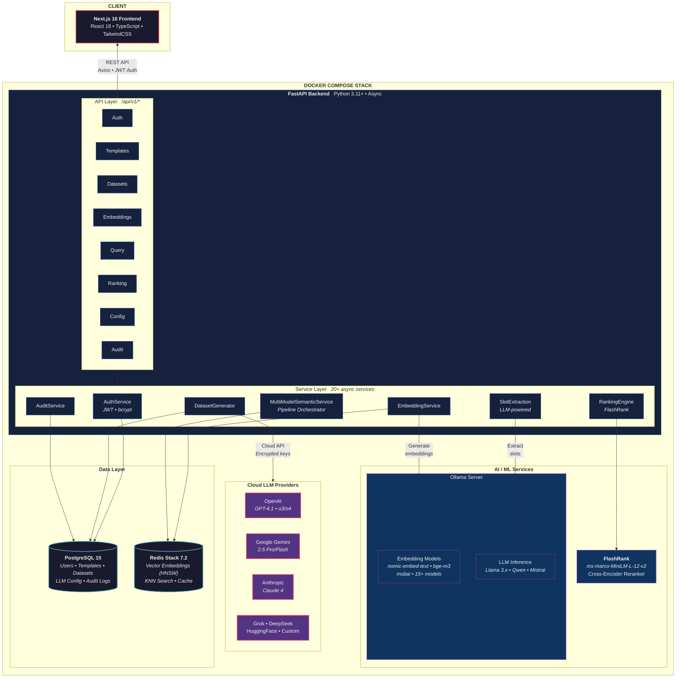

<div align="center">

# NLPForge

### AI-Powered NLP Dataset Generator & Semantic Search Platform

[](https://python.org)
[](https://nextjs.org)
[](https://fastapi.tiangolo.com)
[](https://docker.com)
[](https://github.com/Iammilansoni/NLPFT-2/actions)
[](LICENSE)

*Transform natural language queries into executable API test cases using LLM-powered semantic understanding*

<br />

[](https://www.loom.com/share/YOUR_LOOM_VIDEO_ID)

<!-- TODO: Replace YOUR_LOOM_VIDEO_ID above with your actual Loom share link -->

[Quick Start](#quick-start) &middot; [Documentation](#features) &middot; [Docker](#docker-deployment) &middot; [Contributing](#contributing)

---

</div>

## Table of Contents

- [Overview](#overview)
- [Features](#features)
- [Architecture](#architecture)
- [Tech Stack](#tech-stack)
- [Quick Start](#quick-start)
- [Environment Setup](#environment-setup)
- [Docker Deployment](#docker-deployment)
- [Development Setup](#development-setup)
- [API Documentation](#api-documentation)
- [Embedding Models](#embedding-models)
- [LLM Providers](#llm-providers)
- [Testing](#testing)
- [CI/CD](#cicd)
- [Project Structure](#project-structure)
- [Troubleshooting](#troubleshooting)
- [Security](#security)
- [Contributing](#contributing)
- [License](#license)

---

## Overview

**NLPForge** is an enterprise-grade platform that bridges the gap between natural language and API testing. Describe what you want to test in plain English, and NLPForge processes your request through a two-stage retrieval pipeline to produce structured, executable API test cases.

### How It Works

```
 Input
 "Authenticate with email milansoni@nlpforge.com and password secure123"
                                    |
                                    v
 NLPForge Processing Pipeline
  1. Semantic Understanding ......... Generate query embedding via Ollama
  2. Template Matching .............. Vector similarity search in Redis (Top-5)
  3. Re-ranking ..................... FlashRank cross-encoder scoring
  4. Slot Extraction ................ LLM-powered value extraction
                                    |
                                    v
 Output
  {
    "api_name": "User_Login",
    "base_url": "https://api.nlpforge.com",
    "endpoint": "/auth/login",
    "method": "POST",
    "extracted_request_body": {
      "email": "milansoni@nlpforge.com",
      "password": "secure123"
    }
  }
```

---

## Features

### Semantic Search
- Natural language query processing with multi-model embedding support
- Two-stage retrieval: vector similarity (Stage 1) followed by neural re-ranking (Stage 2)
- Real-time similarity scoring with confidence metrics
- Query filtering by intent, similarity range, and date

### Dataset Generation
- AI-powered synthetic data creation across 8 LLM providers
- Configurable distribution: 70% valid, 20% edge cases, 10% extreme scenarios
- Export to CSV and JSON formats
- Automatic embedding generation on dataset creation

### Template Management
- Postman-style API endpoint builder with slot/parameter definitions
- Minimum 500-word description and 3+ sample utterances per template
- Domain tagging and categorization
- Draft/review/approved workflow with version history

### Analytics Dashboard
- Real-time KPIs: templates, datasets, embeddings, queries
- Intent distribution visualization and query performance tracking
- Usage statistics and model accuracy monitoring

### Enterprise Security
- JWT authentication with email verification (OTP)
- API keys encrypted at rest (Fernet cipher)
- Multi-tenant data isolation
- Rate limiting (100 req/min per IP via SlowAPI + Redis)
- Full audit logging and activity tracking

### Performance
- Fully async architecture (asyncio end-to-end)
- Redis vector caching with HNSW indexes
- Background job processing for dataset generation
- Docker Compose orchestration with health checks on all services

---

## Architecture

### High-Level System Architecture



### Two-Stage Retrieval Pipeline

The core innovation of NLPForge -- combining fast vector recall with precise neural re-ranking for accurate natural-language-to-API matching.

```mermaid
flowchart LR
    subgraph INPUT["<b>Input</b>"]
        Q["User Query<br/><i>'Authenticate with email<br/>and password secure123'</i>"]
    end

    subgraph STAGE1["<b>Stage 1 &mdash; Vector Similarity</b>"]
        direction TB
        EMB["Ollama Embedding<br/><i>nomic-embed-text (768-dim)</i>"]
        VEC["Redis HNSW Index<br/><i>KNN Search (k=5)</i>"]
        S1OUT["Top-5 Candidates<br/><i>Cosine similarity scores</i>"]
        EMB --> VEC --> S1OUT
    end

    subgraph STAGE2["<b>Stage 2 &mdash; Neural Re-ranking</b>"]
        direction TB
        CROSS["FlashRank Cross-Encoder<br/><i>ms-marco-MiniLM-L-12-v2</i>"]
        SCORE["Pairwise Scoring<br/><i>Sigmoid &rarr; 0.0 &ndash; 1.0</i>"]
        S2OUT["Re-ranked Results"]
        CROSS --> SCORE --> S2OUT
    end

    subgraph EXTRACT["<b>Slot Extraction</b>"]
        direction TB
        LLM["LLM Provider<br/><i>Gemini / GPT / Claude / Ollama</i>"]
        JSON["Structured JSON<br/><i>endpoint, method, params</i>"]
        LLM --> JSON
    end

    Q --> EMB
    S1OUT -->|"Top-5<br/>candidates"| CROSS
    S2OUT -->|"Best<br/>match"| LLM

    classDef inputStyle fill:#e8f5e9,stroke:#2e7d32,stroke-width:2px,color:#1b5e20
    classDef stage1Style fill:#e3f2fd,stroke:#1565c0,stroke-width:2px,color:#0d47a1
    classDef stage2Style fill:#fff3e0,stroke:#ef6c00,stroke-width:2px,color:#e65100
    classDef extractStyle fill:#f3e5f5,stroke:#7b1fa2,stroke-width:2px,color:#4a148c

    class Q inputStyle
    class EMB,VEC,S1OUT stage1Style
    class CROSS,SCORE,S2OUT stage2Style
    class LLM,JSON extractStyle
```



| Stage | Method | Model | Output |
|:------|:-------|:------|:-------|
| **Stage 1** | KNN vector similarity search in Redis (HNSW index) | Ollama embedding model (e.g., `nomic-embed-text`) | Top-5 candidates scored by cosine similarity |
| **Stage 2** | Cross-encoder pairwise ranking | FlashRank `ms-marco-MiniLM-L-12-v2` | Final ranked results with 0&ndash;1 relevance scores |
| **Extraction** | LLM-powered slot filling | Any of 8 supported providers | Structured JSON with endpoint, method, parameters |

See [RERANKING_ARCHITECTURE.md](RERANKING_ARCHITECTURE.md) and [STAGE2_DETAILED_EXPLANATION.md](STAGE2_DETAILED_EXPLANATION.md) for mathematical details.

### User Journey

```mermaid
flowchart TD
    subgraph AUTH["Authentication"]
        A1[/"New User"/] --> A2{{"Choose Action"}}
        A2 -->|New Account| A3["Sign Up"]
        A2 -->|Existing User| A4["Sign In"]
        A3 --> A5["Verify Email (OTP)"]
        A5 --> A6["Account Activated"]
        A4 --> A6
        A6 --> A7(["Dashboard"])
    end

    subgraph TEMPLATE["Template Creation"]
        A7 --> B1["Navigate to Templates"]
        B1 --> B2["Create New Template"]
        B2 --> B3["Fill Details<br/><i>API Name &bull; Description (500+ words)<br/>HTTP Method &bull; Endpoint<br/>Parameters &bull; 3+ Samples &bull; Tags</i>"]
        B3 --> B4["Save as Draft"]
        B4 --> B5["Submit for Review"]
        B5 --> B6{{"Expert Review"}}
        B6 -->|Approved| B7["Template Approved"]
        B6 -->|Rejected| B8["Revise & Resubmit"]
        B8 --> B5
    end

    subgraph SETTINGS["Model Configuration"]
        B7 --> C1["Navigate to Settings"]
        C1 --> C2["Configure LLM Provider<br/><i>Select provider &bull; Enter API key<br/>Test connection</i>"]
        C2 --> C3["LLM Configured"]
        C3 --> C4["Configure Embedding Model<br/><i>Download model &bull; Set as default</i>"]
        C4 --> C5["Embedding Model Active"]
    end

    subgraph DATASET["Dataset Generation"]
        C5 --> D1["Navigate to Datasets"]
        D1 --> D2["Generate New Dataset"]
        D2 --> D3["Select Approved Template"]
        D3 --> D4["Configure Generation<br/><i>Row count &bull; Prompt &bull; Scenario mix<br/>70% valid &bull; 20% edge &bull; 10% extreme</i>"]
        D4 --> D5["Start Generation"]
        D5 --> D6["LLM Processing..."]
        D6 --> D7["CSV Dataset Created"]
    end

    subgraph EMBEDDING["Embedding Process"]
        D7 --> E1["Embed Dataset"]
        E1 --> E2["Generating Vectors..."]
        E2 --> E3["Vectors Stored in Redis<br/><i>HNSW index per model</i>"]
        E3 --> E4["Dataset Embedded"]
    end

    subgraph SEARCH["Semantic Search"]
        E4 --> F1["Navigate to Query"]
        F1 --> F2["Enter Natural Language Query"]
        F2 --> F3["Two-Stage Pipeline<br/><i>Stage 1: Vector Similarity (Top-5)<br/>Stage 2: FlashRank Re-ranking</i>"]
        F3 --> F4["Results Ranked"]
        F4 --> F5["Structured JSON Output"]
    end

    classDef authStyle fill:#e8f5e9,stroke:#2e7d32,stroke-width:2px,color:#1b5e20
    classDef templateStyle fill:#e3f2fd,stroke:#1565c0,stroke-width:2px,color:#0d47a1
    classDef settingsStyle fill:#fff3e0,stroke:#ef6c00,stroke-width:2px,color:#e65100
    classDef datasetStyle fill:#f3e5f5,stroke:#7b1fa2,stroke-width:2px,color:#4a148c
    classDef embeddingStyle fill:#e0f7fa,stroke:#00838f,stroke-width:2px,color:#006064
    classDef searchStyle fill:#fce4ec,stroke:#c2185b,stroke-width:2px,color:#880e4f

    class A1,A2,A3,A4,A5,A6,A7 authStyle
    class B1,B2,B3,B4,B5,B6,B7,B8 templateStyle
    class C1,C2,C3,C4,C5 settingsStyle
    class D1,D2,D3,D4,D5,D6,D7 datasetStyle
    class E1,E2,E3,E4 embeddingStyle
    class F1,F2,F3,F4,F5 searchStyle
```

<details>
<summary><strong>Expand full user flow diagram</strong></summary>



</details>

| Phase | Steps | What Happens |
|:------|:------|:-------------|
| **Authentication** | Sign Up &rarr; Verify Email &rarr; Sign In | Create account, confirm via OTP, get JWT token |
| **Templates** | Create &rarr; Fill Details &rarr; Submit &rarr; Approve | Build API template with 500+ word description, 3+ samples |
| **Settings** | Configure LLM &rarr; Configure Embedding | Set up AI provider keys and select embedding model |
| **Datasets** | Select Template &rarr; Configure &rarr; Generate | LLM creates synthetic test data (CSV/JSON) |
| **Embedding** | Embed Dataset &rarr; Store Vectors | Generate embeddings, store in Redis HNSW index |
| **Search** | Enter Query &rarr; Two-Stage Pipeline &rarr; Results | Semantic search with vector recall + neural re-ranking |

---

## Tech Stack

| Layer | Technology | Purpose |
|:------|:-----------|:--------|
| **Frontend** | Next.js 16, React 18.3, TypeScript 5, TailwindCSS 3.4, Radix UI | App Router SPA with server components |
| **Data Fetching** | TanStack Query v5, Axios | Server state management and HTTP client |
| **UI/UX** | Framer Motion, Recharts, Lucide Icons | Animations, charts, iconography |
| **Backend** | FastAPI 0.123+, Python 3.11+, Pydantic v2 | Async REST API with validation |
| **ORM** | SQLAlchemy 2.0 (async), Alembic | Database toolkit and migrations |
| **Database** | PostgreSQL 15 (asyncpg driver) | Relational data, user accounts, templates |
| **Vector DB** | Redis Stack 7.2 (HNSW indexes) | Embedding storage and KNN search |
| **Embeddings** | Ollama (15+ models) | Local embedding generation |
| **LLM** | 8 providers (OpenAI, Gemini, Anthropic, Grok, DeepSeek, Ollama, HuggingFace, Custom) | Dataset generation and slot extraction |
| **Re-ranking** | FlashRank (`ms-marco-MiniLM-L-12-v2`) | Neural cross-encoder scoring |
| **Auth** | python-jose (JWT), Passlib (bcrypt), Fernet (API key encryption) | Authentication and secrets management |
| **DevOps** | Docker Compose, GitHub Actions | Containerization and CI/CD |
| **Testing** | pytest, Jest, Playwright | Backend unit/integration, frontend unit/E2E |

---

## Quick Start

### Prerequisites

| Requirement | Minimum | Recommended |
|:------------|:--------|:------------|
| Docker & Docker Compose | v2.0+ | Latest |
| RAM | 8 GB | 16 GB+ |
| Disk Space | 10 GB | 20 GB+ |
| Git | v2.0+ | Latest |

### 1. Clone the Repository

```bash
git clone https://github.com/Iammilansoni/NLPFT-2.git
cd NLPFT-2
```

### 2. Configure Environment

```bash
cp Backend/.env.example Backend/.env
cp Frontend/.env.example Frontend/.env.local
```

Edit `Backend/.env` with your values:

```bash
# Generate a secure key:
# python -c "import secrets; print(secrets.token_urlsafe(32))"
SECRET_KEY=your_generated_secret_key_here

# Get from: https://aistudio.google.com/apikey
GEMINI_API_KEY=your_gemini_api_key

# Database passwords
POSTGRES_PASSWORD=your_secure_postgres_password
REDIS_PASSWORD=your_secure_redis_password

# Email (for registration and password reset)
SMTP_USER=your_email@gmail.com
SMTP_PASSWORD=your_gmail_app_password
```

### 3. Launch

```bash
docker compose up -d --build
```

First run downloads container images and may take several minutes. Monitor progress:

```bash
docker compose logs -f
```

### 4. Access

| Service | URL | Credentials |
|:--------|:----|:------------|
| Web App | http://localhost:3000 | Create new account |
| API Docs (Swagger) | http://localhost:8000/docs | -- |
| API Docs (ReDoc) | http://localhost:8000/redoc | -- |
| pgAdmin | http://localhost:5050 | admin@example.com / admin123 |
| RedisInsight | http://localhost:8001 | -- |
| Redis Commander | http://localhost:8081 | admin / admin123 |

### 5. First Steps

1. **Register** an account at `/auth/register` and verify your email
2. **Create a template** defining your API endpoint (500+ word description, 3+ samples)
3. **Generate a dataset** using your preferred LLM provider
4. **Embed** the dataset to create searchable vectors
5. **Query** with natural language to get structured JSON results

---

## Environment Setup

### Backend (`Backend/.env`)

| Variable | Required | Description |
|:---------|:--------:|:------------|
| `SECRET_KEY` | Yes | JWT signing key (minimum 32 characters) |
| `SECRET_KEY_ENCRYPTION` | Yes | Fernet key for API key encryption at rest |
| `GEMINI_API_KEY` | Yes | Google Gemini API key for dataset generation |
| `POSTGRES_USER` | Yes | PostgreSQL username (default: `nlpforge`) |
| `POSTGRES_PASSWORD` | Yes | PostgreSQL password |
| `POSTGRES_DB` | Yes | PostgreSQL database name (default: `nlpforge`) |
| `REDIS_PASSWORD` | Yes | Redis password |
| `SMTP_HOST` | Yes | SMTP server host (default: `smtp.gmail.com`) |
| `SMTP_PORT` | Yes | SMTP port (default: `587`) |
| `SMTP_USER` | Yes | SMTP username/email |
| `SMTP_PASSWORD` | Yes | SMTP password (use Gmail App Password) |
| `OLLAMA_BASE_URL` | No | Ollama server URL (default: `http://localhost:11434`) |
| `FRONTEND_URL` | No | Frontend URL for CORS (default: `http://localhost:3000`) |
| `CORS_ORIGINS` | No | Comma-separated allowed origins |
| `LOG_LEVEL` | No | Logging level: `DEBUG`, `INFO`, `WARNING` (default: `INFO`) |
| `ENVIRONMENT` | No | `development` or `production` |

### Frontend (`Frontend/.env.local`)

| Variable | Required | Description |
|:---------|:--------:|:------------|
| `NEXT_PUBLIC_API_URL` | Yes | Backend API base URL (default: `http://localhost:8000`) |

> **Note**: Never commit `.env` files with real credentials to version control.

---

## Docker Deployment

### Production

All services run in Docker containers (PostgreSQL, Redis, Ollama, Backend, Frontend, admin tools):

```bash
# Start all services
docker compose up -d --build

# View logs
docker compose logs -f

# View logs for a specific service
docker compose logs -f backend

# Check service health
docker compose ps

# Stop services
docker compose down

# Full reset (removes all data)
docker compose down -v && docker compose up -d --build
```

### Port Reference

| Service | Port | Description |
|:--------|:-----|:------------|
| Frontend | 3000 | Next.js web application |
| Backend | 8000 | FastAPI server |
| PostgreSQL | 5433 | Database (mapped from 5432) |
| Redis | 6379 | Vector database |
| RedisInsight | 8001 | Redis web UI |
| Redis Commander | 8081 | Redis management |
| pgAdmin | 5050 | PostgreSQL admin |
| Ollama | 11434 | LLM inference (internal to Docker network) |

---

## Development Setup

Use `docker-compose.dev.yml` to run infrastructure in Docker while developing the application locally with hot reload.

### 1. Start Infrastructure

```bash
docker compose -f docker-compose.dev.yml up -d
```

### 2. Start Ollama and Pull Models

```bash
ollama serve

# In a separate terminal:
ollama pull nomic-embed-text              # Recommended embedding model
ollama pull llama3.2:3b-instruct-q4_K_M   # LLM for dataset generation
```

### 3. Start Backend

```bash
cd Backend
python -m venv venv
source venv/bin/activate   # Windows: venv\Scripts\activate
pip install -r requirements.txt
alembic upgrade head
uvicorn app.main:app --reload --port 8000
```

### 4. Start Frontend

```bash
cd Frontend
npm install
npm run dev
```

The frontend is available at http://localhost:3000 and the backend API docs at http://localhost:8000/docs.

---

## API Documentation

Interactive documentation is available when the backend is running:

- **Swagger UI**: http://localhost:8000/docs
- **ReDoc**: http://localhost:8000/redoc

### Core Endpoints

<details>
<summary><strong>Authentication</strong></summary>

| Method | Endpoint | Description |
|:-------|:---------|:------------|
| `POST` | `/api/v1/auth/register` | Register new user |
| `POST` | `/api/v1/auth/login` | User login |
| `POST` | `/api/v1/auth/logout` | User logout |
| `POST` | `/api/v1/auth/refresh` | Refresh access token |
| `POST` | `/api/v1/auth/forgot-password` | Request password reset email |
| `POST` | `/api/v1/auth/reset-password` | Reset password with token |

</details>

<details>
<summary><strong>Templates</strong></summary>

| Method | Endpoint | Description |
|:-------|:---------|:------------|
| `GET` | `/api/v1/template-builder/templates` | List all templates |
| `POST` | `/api/v1/template-builder/templates` | Create new template |
| `GET` | `/api/v1/template-builder/templates/{id}` | Get template by ID |
| `PUT` | `/api/v1/template-builder/templates/{id}` | Update template |
| `DELETE` | `/api/v1/template-builder/templates/{id}` | Delete template |

</details>

<details>
<summary><strong>Datasets</strong></summary>

| Method | Endpoint | Description |
|:-------|:---------|:------------|
| `GET` | `/api/v1/datasets` | List all datasets |
| `POST` | `/api/v1/datasets/generate` | Generate new dataset |
| `GET` | `/api/v1/datasets/{id}` | Get dataset details |
| `DELETE` | `/api/v1/datasets/{id}` | Delete dataset |
| `GET` | `/api/v1/datasets/{id}/download` | Download dataset (CSV/JSON) |

</details>

<details>
<summary><strong>Query & Search</strong></summary>

| Method | Endpoint | Description |
|:-------|:---------|:------------|
| `POST` | `/api/v1/multi-model-query` | Multi-model semantic search |
| `POST` | `/api/v1/embeddings/search` | Vector similarity search |
| `POST` | `/api/v1/ranking/rerank` | Re-rank search results |

</details>

<details>
<summary><strong>Embeddings</strong></summary>

| Method | Endpoint | Description |
|:-------|:---------|:------------|
| `POST` | `/api/v1/embeddings/validate` | Validate embedding model |
| `GET` | `/api/v1/embeddings/download` | Download embedding vectors |

</details>

<details>
<summary><strong>Configuration</strong></summary>

| Method | Endpoint | Description |
|:-------|:---------|:------------|
| `GET/PUT` | `/api/v1/llm-config` | LLM provider configuration |
| `GET/PUT` | `/api/v1/user-settings` | User embedding preferences |
| `GET` | `/api/v1/audit-logs` | Audit trail |

</details>

---

## Embedding Models

NLPForge supports 15+ embedding models via Ollama. Choose based on your accuracy, speed, and resource requirements.

### Recommended Models

| Model | Parameters | Dimensions | Context | Speed | Best For |
|:------|:----------:|:----------:|:-------:|:-----:|:---------|
| `nomic-embed-text` | 137M | 768 | 8192 | Fast | **Default** -- production RAG, long documents |
| `all-minilm` | 22-33M | 384 | 256 | Fastest | Prototyping, edge devices, low resources |
| `mxbai-embed-large` | 335M | 1024 | 512 | Moderate | State-of-the-art accuracy, enterprise search |
| `bge-m3` | 567M | 1024 | 8192 | Moderate | Multilingual (100+ languages), hybrid retrieval |
| `snowflake-arctic-embed` | 22-335M | 256-1024 | 512 | Fast | Enterprise retrieval, multiple size options |
| `qwen3-embedding` | 0.6-8B | 1024-4096 | 8192 | Slow | Maximum quality, research workloads |
| `granite-embedding` | 30-278M | 256-768 | 512 | Fast | IBM enterprise, multilingual |

### Additional Models

| Model | Parameters | Context | Best For |
|:------|:----------:|:-------:|:---------|
| `bge-base` | 109M | 512 | Balanced performance, general retrieval |
| `bge-large` | 335M | 512 | High accuracy English, QA, semantic search |
| `nomic-embed-text-v2-moe` | 300M (MoE) | 8192 | Multilingual, state-of-the-art |
| `snowflake-arctic-embed2` | 568M | 8192 | Frontier model, long context |
| `embeddinggemma` | 300M | 2048 | Google ecosystem, versatile |
| `paraphrase-multilingual` | 278M | 512 | 50+ languages, semantic similarity |

### Switching Models

1. Navigate to **Settings > Embedding Model**
2. Select your preferred model (downloads automatically if not installed)
3. Re-embed existing datasets if switching models -- each model produces different vector dimensions

> **Tip**: Start with `nomic-embed-text` for most use cases. Use `bge-m3` for multilingual content, or `qwen3-embedding:8b` for maximum quality.

---

## LLM Providers

NLPForge supports 8 LLM providers for dataset generation and slot extraction. All API keys are encrypted at rest.

| Provider | Notable Models | Notes |
|:---------|:---------------|:------|
| **OpenAI** | GPT-4.1, GPT-4o, o3, o4 | Premium quality, production workloads |
| **Google Gemini** | Gemini 2.5 Pro/Flash, Gemini 2.0 | High-quality outputs, generous free tier |
| **Anthropic** | Claude 4, Claude 3.5 Sonnet | Nuanced understanding, safety-focused |
| **Grok (xAI)** | Grok 3, Grok 4 | Fast reasoning, up to 2M token context |
| **DeepSeek** | DeepSeek Chat, Coder, R1 | Strong reasoning, code generation |
| **Ollama** | Llama 3.x, Qwen 2.5, Mistral | Local inference, privacy-first, no API key |
| **HuggingFace** | Meta Llama, Gemma, Qwen, Mistral | Cloud inference API |
| **Custom** | Any OpenAI-compatible endpoint | Self-hosted models, custom URLs |

### Configuration

1. Navigate to **Settings > LLM Providers**
2. Add your API key for the desired provider
3. Select the default provider and model
4. Adjust model parameters (temperature, max tokens, etc.)

---

## Testing

### Backend

```bash
cd Backend

# Run all unit tests
pytest -v --tb=short -m "not integration"

# Run a specific test
pytest -k test_function_name

# Run with coverage
pytest --cov

# Run integration tests (requires running infrastructure)
pytest -m integration
```

Backend tests use SQLite in-memory by default (configured in `tests/conftest.py`). Use `@pytest.mark.asyncio` for async tests.

### Frontend

```bash
cd Frontend

# Jest unit tests
npm test

# Watch mode
npm run test:watch

# Playwright E2E tests
npm run test:e2e

# E2E tests with interactive UI
npm run test:e2e:ui
```

---

## CI/CD

The project uses GitHub Actions for continuous integration and security auditing.

### CI Pipeline (`.github/workflows/ci.yml`)

Runs on push to `main`/`develop` and on pull requests to `main`:

| Job | What it does |
|:----|:-------------|
| **Backend Lint** | Runs [Ruff](https://docs.astral.sh/ruff/) on `app/` |
| **Backend Tests** | Runs pytest (unit tests only, SQLite in-memory) |
| **Frontend Build** | Runs ESLint and `next build` |

### Security Audit (`.github/workflows/security.yml`)

Runs weekly (Monday 9:00 UTC) and on manual trigger:

| Job | What it does |
|:----|:-------------|
| **Backend Audit** | `pip-audit` scans Python dependencies for vulnerabilities |
| **Frontend Audit** | `npm audit` scans Node.js dependencies for vulnerabilities |

---

## Project Structure

```
NLPForge/
├── Backend/
│   ├── app/
│   │   ├── api/v1/              # REST API endpoints
│   │   │   ├── auth.py          # Authentication (register, login, password reset)
│   │   │   ├── datasets.py      # Dataset management & generation
│   │   │   ├── embeddings.py    # Embedding operations
│   │   │   ├── embedding_validation.py
│   │   │   ├── email_verification.py
│   │   │   ├── llm_config.py    # LLM provider configuration
│   │   │   ├── template_builder.py
│   │   │   ├── ranking.py       # Re-ranking service
│   │   │   ├── multi_model_query.py
│   │   │   ├── user_settings.py
│   │   │   ├── audit_logs.py
│   │   │   └── admin.py
│   │   ├── core/                # Configuration and utilities
│   │   │   ├── config.py        # Application settings (Pydantic BaseSettings)
│   │   │   ├── security.py      # JWT, password hashing, API key encryption
│   │   │   ├── postgres.py      # Async database session management
│   │   │   └── logger.py
│   │   ├── models/              # SQLAlchemy ORM models & Pydantic schemas
│   │   │   ├── database_models.py
│   │   │   └── schemas/
│   │   ├── services/            # Business logic layer (20+ async services)
│   │   │   ├── auth_service.py
│   │   │   ├── embedding_service.py
│   │   │   ├── multi_model_semantic_service.py  # Pipeline orchestration
│   │   │   ├── redis_vector_service.py          # Stage 1: vector search
│   │   │   ├── dataset_service.py
│   │   │   ├── llm_config_service.py
│   │   │   ├── audit_service.py
│   │   │   └── ...
│   │   ├── nlp/                 # NLP processing
│   │   │   ├── ranking_engine.py       # Stage 2: FlashRank re-ranking
│   │   │   ├── dataset_generator.py    # LLM-based dataset creation
│   │   │   └── embedding_manager.py
│   │   ├── llm/                 # LLM provider integrations
│   │   │   ├── provider_factory.py     # Factory pattern entry point
│   │   │   └── providers/              # OpenAI, Gemini, Anthropic, Grok, etc.
│   │   └── main.py              # FastAPI app entry point
│   ├── alembic/                 # Database migrations
│   ├── tests/                   # pytest test suite
│   ├── requirements.txt
│   └── Dockerfile
│
├── Frontend/
│   ├── app/                     # Next.js App Router pages
│   │   ├── auth/                # Login, register, verify email, password reset
│   │   ├── dashboard/           # Main dashboard with KPIs
│   │   ├── templates/           # Template management
│   │   ├── datasets/            # Dataset management & generation wizard
│   │   ├── query/               # Semantic search interface
│   │   ├── settings/            # LLM and embedding model configuration
│   │   └── ...                  # About, terms, privacy, contact, etc.
│   ├── components/              # Reusable React components
│   │   ├── ui/                  # Base components (buttons, cards, dialogs, forms)
│   │   ├── dashboard/           # Dashboard-specific components
│   │   ├── search/              # Search interface components
│   │   ├── datasets/            # Dataset management UI
│   │   ├── settings/            # Settings page components
│   │   └── ...
│   ├── lib/                     # API client, types, validators, utilities
│   ├── hooks/                   # Custom React hooks
│   ├── contexts/                # React Context providers (Auth, Sidebar)
│   ├── styles/                  # Global CSS and theme variables
│   ├── package.json
│   └── Dockerfile
│
├── .github/workflows/           # CI and security audit pipelines
│   ├── ci.yml
│   └── security.yml
├── docker-compose.yml           # Production deployment
├── docker-compose.dev.yml       # Development (infrastructure only)
├── CLAUDE.md                    # Developer guidance
├── RERANKING_ARCHITECTURE.md    # Two-stage pipeline documentation
├── STAGE2_DETAILED_EXPLANATION.md
└── README.md
```

---

## Troubleshooting

<details>
<summary><strong>Docker: Services fail to start</strong></summary>

```bash
# Check logs for the failing service
docker compose logs backend
docker compose logs postgres

# Restart everything
docker compose down && docker compose up -d --build
```

</details>

<details>
<summary><strong>Docker: Port already in use</strong></summary>

```bash
# Find the process using the port (Linux/Mac)
lsof -i :8000

# Kill it or change the port mapping in docker-compose.yml
```

</details>

<details>
<summary><strong>Docker: Out of disk space</strong></summary>

```bash
docker system prune -a --volumes
```

</details>

<details>
<summary><strong>Auth: "SECRET_KEY must be at least 32 characters"</strong></summary>

```bash
# Generate a secure key
python -c "import secrets; print(secrets.token_urlsafe(32))"

# Paste the output into Backend/.env as SECRET_KEY
```

</details>

<details>
<summary><strong>Auth: "GEMINI_API_KEY not set"</strong></summary>

1. Visit https://aistudio.google.com/apikey
2. Create a new API key
3. Add to `Backend/.env`: `GEMINI_API_KEY=your_key`

</details>

<details>
<summary><strong>Ollama: Connection refused</strong></summary>

```bash
# Check if Ollama is running
curl http://localhost:11434/api/tags

# If using Docker, check the container
docker compose logs ollama

# Start Ollama manually if running outside Docker
ollama serve
```

</details>

<details>
<summary><strong>Ollama: Model not found</strong></summary>

```bash
ollama pull nomic-embed-text
ollama pull llama3.2:3b-instruct-q4_K_M
```

</details>

<details>
<summary><strong>Database: PostgreSQL connection fails</strong></summary>

```bash
docker compose ps postgres
docker compose logs postgres

# Reset database
docker compose down -v
docker compose up -d postgres
```

</details>

<details>
<summary><strong>Database: Redis connection fails</strong></summary>

```bash
docker compose logs redis

# Test connection
docker compose exec redis redis-cli -a <password> ping
```

</details>

<details>
<summary><strong>Frontend: "Failed to fetch" or CORS errors</strong></summary>

1. Verify the backend is running: http://localhost:8000/docs
2. Check `NEXT_PUBLIC_API_URL` in `Frontend/.env.local`
3. Check that `CORS_ORIGINS` in `Backend/.env` includes the frontend URL
4. Inspect the browser console for specific error messages

</details>

<details>
<summary><strong>Frontend: Build fails</strong></summary>

```bash
docker compose build --no-cache frontend
```

</details>

### Cleanup

```bash
# Stop all services
docker compose down

# Remove all data (destructive)
docker compose down -v

# Remove NLPForge images
docker rmi $(docker images | grep nlpforge | awk '{print $3}')

# Full Docker cleanup
docker system prune -a
```

---

## Security

| Practice | Description |
|:---------|:------------|
| **JWT Authentication** | Tokens signed with `SECRET_KEY` (minimum 32 characters), stored as HttpOnly cookies |
| **API Key Encryption** | LLM provider keys encrypted at rest using Fernet (`SECRET_KEY_ENCRYPTION`) |
| **Password Hashing** | Bcrypt via Passlib with automatic salt generation |
| **Rate Limiting** | 100 requests/minute per IP, enforced via SlowAPI with Redis backend |
| **Multi-Tenant Isolation** | All user data is scoped per-user; no cross-tenant access |
| **Audit Logging** | All significant actions are logged with timestamps and user context |
| **CORS** | Configurable allowed origins; defaults to `localhost:3000` in development |
| **Dependency Auditing** | Weekly automated scans via `pip-audit` and `npm audit` |

> **Important**: Generate unique `SECRET_KEY` and `SECRET_KEY_ENCRYPTION` values for each environment. Use Gmail App Passwords rather than real account passwords. Change default admin credentials for pgAdmin and Redis Commander in production.

---

## Contributing

Contributions are welcome. Here's how to get started:

### Setup

```bash
# Fork and clone
git clone https://github.com/YOUR_USERNAME/NLPFT-2.git
cd NLPFT-2

# Set up environment
cp Backend/.env.example Backend/.env
cp Frontend/.env.example Frontend/.env.local

# Start infrastructure
docker compose -f docker-compose.dev.yml up -d

# Create a feature branch
git checkout -b feature/your-feature
```

### Testing Your Changes

```bash
# Backend
cd Backend && pytest -v

# Frontend
cd Frontend && npm test
```

### Submitting

```bash
git commit -m "feat: add your feature"
git push origin feature/your-feature
# Open a Pull Request on GitHub
```

### Commit Convention

| Prefix | Description |
|:-------|:------------|
| `feat:` | New feature |
| `fix:` | Bug fix |
| `docs:` | Documentation |
| `style:` | Formatting (no logic change) |
| `refactor:` | Code restructuring |
| `test:` | Adding or updating tests |
| `chore:` | Maintenance and tooling |

---

## License

This project is licensed under the **MIT License**. See the [LICENSE](LICENSE) file for details.

---

## Contributors

<table>
<tr>
<td align="center">
<a href="https://github.com/Iammilansoni">
<br />
<sub><b>Milan Soni</b></sub>
</a>
</td>
<td align="center">
<a href="https://github.com/Avadhi-Singhal">
<br />
<sub><b>Avadhi Singhal</b></sub>
</a>
</td>
<td align="center">
<a href="https://github.com/AbhilashJoshi09">
<br />
<sub><b>Abhilash Joshi</b></sub>
</a>
</td>
</tr>
</table>

---

<div align="center">

[Report Bug](https://github.com/Iammilansoni/NLPFT-2/issues) &middot; [Request Feature](https://github.com/Iammilansoni/NLPFT-2/issues)

</div>
